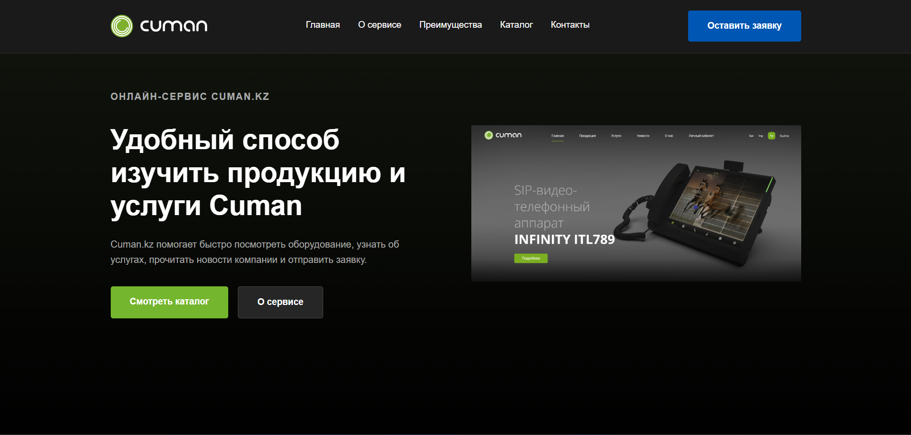

# Cuman.kz - промо лендинг
Одностраничный промо-сайт для онлайн сервиса cuman.kz (https://www.cuman.kz)

## Стек технологий
HTML5
CSS3
Vanilla JavaScript

## Структура проекта
cuman-lending/
├── index.html
├── css/
│   └── style.css
├── js/
│   └── script.js
├── img
|   └── about.png, mainpage.png, screenshot.png
└── README.md

## Функциональность
Адаптивная верстка (1440px+, 992px, 480px)
Бургер-меню для мобильных устройств
Плавная анимация появления элементов при скролле (использован IntersectionObserver)
Форма обратной связи с валидацией и статусом отправки
Плавный скролл к якорным ссылкам

## Секции сайта
Hero — главный экран с описанием сервиса
О сервисе — краткое описание платформы
Преимущества — 4 ключевых преимущества cuman.kz
Каталог — популярные позиции оборудования
Контакты — форма заявки и контактная информация

## Локальный запуск
Проект не требует сборки или установки зависимостей.
1. Нужно скачать папку проекта и разархивировать или клонировать репозиторий:

git https://github.com/YermakhanKhamitov/cuman-lending.git

2. Открыть файл index.html в браузере.

Готово — сайт работает локально без сервера

## Демо
[Посмотреть на GitHub Pages](https://YermakhanKhamitov.github.io/cuman-lending)